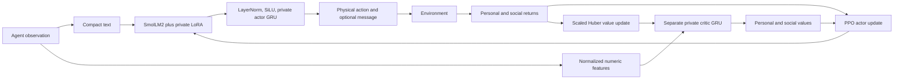

# Next experiment: LLM actors, isolated critics, and predator uncertainty

The default remains an **LLM experiment**. Each agent uses the pinned SmolLM2-135M-Instruct transformer, its own trainable LoRA adapter, and its own recurrent action controller. There is no hosted API or external GPU requirement. The optional `numeric` phase is a separate diagnostic baseline; its speed is not the speed of the LLM experiment.

## Why change this architecture?

The old policy already uses actor–critic PPO. The problem is how its objectives interact. A survival value error can be hundreds of times larger than the action-learning signal. When both losses change the same recurrent representation and LLM adapter, value fitting can overwhelm useful distinctions between observations. The earlier audit found projection saturation and a much larger critic gradient in one inspected minibatch. That is evidence for testing isolation, not proof of the cause of poor learning.

The new `controller_architecture: split` keeps the LLM as the actor:



Both branches use the agent's observation, never simulator `info` or global state. The critic has richer access to the same observation arrays than the compact LLM serialization; it is not a centralized critic. The LLM base weights remain frozen, but the agent's private LoRA weights and action controller learn. PPO's policy loss and entropy bonus update the actor; only the value loss updates the separate critic. Actor/LoRA and critic gradients are clipped separately. Normalized inputs, LayerNorm and SiLU replace the old projection followed by tanh. The critic outputs values in reward units; its Huber loss divides predictions and targets by a fixed scale of 100. This is fixed scaling, not PopArt.

Live updates happen every 32 world ticks instead of 128. This gives more agents an update before birth or death. The social accounting window stays 256 ticks; dead agents wait for their realized social tail without generating fictitious actions. A checkpoint preserves unfinished accounting. A fixed decision budget can therefore end with pending dead-agent updates, which the summary reports.

Keeping PPO is a conservative starting point, consistent with its sampled-interaction/multiple-minibatch design ([original paper](https://arxiv.org/abs/1707.06347)). It does not guarantee convergence or a global optimum in a changing multi-agent game. This test changes a bundle of engineering choices; improvement over the old pilot would not identify which change caused it. `--phase shared` tests the new LLM architecture with shared actor/critic representation, but different warm-start representations remain a confound.

## Incentives and what remains difficult

The actor combines advantages as `A_personal + alpha * A_social` before normalization. Profiles retain alpha 0, +0.5, -0.5, and the vigilance prior. Social reward stays `other_living / 16`; founders stay 8 and cap stays 16. Separate value heads preserve the distinction between individual survival and external benefits.

At alpha +0.5, keeping one additional peer alive adds only 0.03125 reward per tick. This intentionally leaves a tradeoff with individual costs. A cooperative action is favored only if its estimated discounted benefit outweighs its cost. Changing alpha changes the desired compromise; no architecture can simultaneously optimize every conflicting objective. A useful result is a measured survival/food/peer-benefit tradeoff, not an assertion that the population found the global optimum.

This reward pays for peers remaining alive, not specifically for increasing their learned competence. R-adult tests vertical weight inheritance. Neither mechanism directly implements teacher credit, verification of a learned claim, group migration or cumulative language-mediated knowledge. Those parts of the broader thesis remain untested.

Remaining bottlenecks include sparse delayed survival feedback, imperfect food navigation, short lives, independent policy drift, and uncertain social credit. The critic sees only local information, so predicting distant peers' survival remains noisy. Shorter updates and isolation help optimization, but create no new causal information. If food acquisition still fails, first test stronger observation-limited demonstrations or a separate, carefully controlled reward-shaping arm. If social value prediction remains poor after individual competence improves, a centralized training-only critic with permutation-invariant population features is a reasonable next ablation; it is not implemented here.

## Measurable environment difficulty

The new predator kernel moves with probability 0.9, as before. Conditional on moving, a legal neighbor `c` receives probability proportional to `exp(-(d(c,target)-min_d)/T_predator)`, where distance is the shortest path around walls. The target remains the nearest visible prey, otherwise a food patrol station. At zero temperature, shortest-path neighbors share all probability. At large temperature, movement approaches a uniform random walk. Stay probability, vision, attacks, cooldown and energy dynamics stay fixed. Setting temperature to `null` restores the original 70% greedy / 20% random / 10% stay kernel exactly.

**Temperature is an uncertainty parameter; difficulty must be measured.** Eight development-map comparisons gave these restricted mean lifetimes (512-tick horizon):

| Predator T | Food heuristic | Vigilant heuristic | Mean of those two |
| --- | ---: | ---: | ---: |
| 0 | 137.97 | 190.86 | 164.41 |
| 0.25 | 143.41 | 190.86 | 167.13 |
| 1 | 197.55 | 240.42 | 218.98 |
| 4 | 296.64 | 303.63 | 300.13 |

In this calibration, **lowering** predator temperature is harder. The near-tie at 0 and 0.25 should not be overinterpreted. Results are policy-dependent and eight maps are not a universal ranking. See [saved calibration](results/next-predator-calibration.json). Re-run calibration with `--mode calibrate`; it uses development maps only.

Training stays at T=1 for the primary comparison. Final frozen policies are evaluated at T=0, 1 and 4 on common held-out map seeds. Report lifetime, survival, food consumed per living decision, starvation, predation and conditional movement entropy against temperature. Matching map seeds does not keep trajectories identical after policies diverge.

The actor has a separate temperature setting. Its default stays at 1 throughout training and evaluation. An optional linear schedule records collection temperature per transition, so PPO reconstructs the correct old-temperature action distribution even for delayed updates. Actor temperature changes exploration; it is not the task-difficulty knob.

`--mode gate --run-dir ...` is an advisory curriculum check on development results only. It requires three nonzero checkpoints with mean lifetime at least half the horizon, at least 25% survival, a lifetime range at most 5% of the horizon, and a gain of at least 5% of the horizon over the initial policy. These explicit heuristic thresholds guard against interpreting low-score stagnation as saturation. They are not a statistical saturation test. The runner does **not** silently change the task during a comparison or automatically carry learned weights into a new curriculum stage. Temperature sweeps are frozen-policy robustness tests. An adaptive training curriculum and explicit stage-transfer protocol should be a subsequent controlled experiment after this gate passes.

## Communication: useful test, bounded claim

Run the communication phases after demonstrating basic food acquisition. An LLM-backed actor chooses one of three learned symbols or silence alongside its movement. Packets contain the chosen symbol and sender position, have radius 6 and capacity 4, arrive on the next observation, and expire after one observation. Non-silent transmission costs 0.02 energy. Capacity favors nearest senders at send time. Agents cannot inspect each other's parameters or hidden state.

`communication` and `muted` use identical action spaces, fees and a byte-identical shared warm start. The muted arm drops packets before delivery. Warm demonstrations supervise physical movement only. The delivered arm also receives a frozen-policy muted evaluation. Training-arm comparison measures whether learning with delivery helps; test-time muting measures whether an already-trained policy relies on messages. Neither alone proves teaching or knowledge accumulation. WATCH's existing automatic truthful alarms remain in both arms, so the new channel must add value beyond them.

This is **not free-form LLM dialogue**. The LLM representation drives a small policy head and receives symbols serialized in text. A bounded learned channel tests information transfer cheaply; natural-language generation would expand the action space and credit-assignment problem substantially ([early learned-communication work](https://arxiv.org/abs/1605.06676)).

For a later language-swarm test, I recommend occasional short grounded reports—observed food, threat, intended destination—with explicit timestamps, sender identity, bandwidth cost and receiver verification. Compare delivered, muted, and shuffled reports using the same world budget, and also report wall time/tokens. Use a capable instruction-tuned LLM for that test; a 135M model with movement-head LoRA is a CPU-feasible learning instrument, not evidence of strong language reasoning. Do not infer the utility of natural-language collaboration from a failure of these arbitrary symbols.

## Run the LLM experiment

From the repository root with the existing `.venv`:

```bash
bash scripts/next_experiment.sh --mode plan
bash scripts/next_experiment.sh --mode benchmark
bash scripts/next_experiment.sh --mode calibrate
bash scripts/next_experiment.sh --mode run --hours 10
```

Repeat the last command to resume. On macOS, optionally prefix it with `caffeinate -i` to keep the machine awake. Outputs go to `runs/next-llm-core`; the old `runs/overnight-profiles` is separate and remains resumable. First use needs the model download; a cached run may set `HF_HUB_OFFLINE=1`.

The primary plan is **4 profiles × 3 methods × seed 11**, with **65,536 decisions per run** (4× the earlier pilot), a common 8,192-demonstration warm start, checkpoints at 0/16,384/32,768/65,536, 512-tick evaluation and four final maps. All profiles are visited before moving to the next method. The 786,432 training decisions are a multi-night CPU study, not a promise to finish in one ten-hour invocation. The soft hour limit includes warm starts, updates and evaluations that must finish before pausing.

The [saved Mac benchmarks](results/next-llm-benchmarks.json) measured 4.75 decisions/second with four CPU threads (128 ticks) and 5.37 with one thread (64 ticks), including PPO but excluding warm starts, evaluations, probes and checkpoint I/O. The four-thread measurement partly overlapped other validation work, so this is not a controlled thread-count comparison. These rates imply roughly **40–46 hours of training alone** for the full matrix; allow additional time for evaluation. Peak benchmark process memory was about 1.6 GiB. The configured upper bound is 122,880 frozen evaluation decisions per run, excluding newborn assays; actual evaluation is usually shorter because bodies die. A short benchmark cannot promise a completion time. The runner's hour limit is the practical local compute control.

The [real cached-model validation](results/next-llm-validation.json) completed 256 demonstration transitions, 512 training decisions, 40 optimizer minibatches and 1,536 evaluation decisions, with observable changes to private LoRA weights and working message/muted/temperature assays. It took about 50 seconds to warm start and 420 seconds to train plus evaluate. The 32-tick evaluation horizon was deliberately too short for a survival claim. A subsequent guard against floating-point message-head gradients during physical-only warm starts is separately covered by a unit test. The full test suite also checks gradient isolation, independent policy updates, delayed messages, temperature likelihood replay, birth inheritance and deterministic checkpoint recovery.

Test maps start at 4,000,000, development maps at 3,000,000, newborn maps at 4,100,000. Training uses the existing seed/trial schedule. Both population and founders reset for frozen evaluations and reproduction is disabled there. Differences between methods must be computed within this new configuration; the predator kernel and architecture changed from the old pilot. One training seed supports feasibility screening and paired descriptive comparisons, not a reliable population-level conclusion.

Optional separate experiments:

```bash
bash scripts/next_experiment.sh --phase communication --mode run --hours 10
bash scripts/next_experiment.sh --phase muted --mode run --hours 10
bash scripts/next_experiment.sh --phase shared --mode run --hours 10
bash scripts/next_experiment.sh --mode report
bash scripts/next_experiment.sh --mode gate --run-dir runs/next-llm-core/prosocial-r_adult-s11
```

The first two phases compare individual/prosocial profiles under R-adult, two runs each. Run them serially: they share `runs/next-llm-communication-warm`. A custom `--warmstart-dir` must match the architecture/environment. The `numeric` phase explicitly selects a separate non-LLM diagnostic baseline; it is never the default.

New logs are `development_evaluation.jsonl`, `predator_evaluation.jsonl`, and (communication phases) `evaluation_muted.jsonl`. Existing evaluation logs now include food and conditional feeding metrics; update logs add approximate KL, clipping fraction, separate gradient norms, and value explained variance. `events.jsonl` records symbols, while ecology/evaluation record sent/delivered counts. `probes.jsonl` retains seven physical-action probabilities by marginalizing over symbols. Checkpoints include messages, sampling temperature, recurrent state, optimizers and RNG state.

Operational success means the runner resumes reproducibly and the intended weights receive gradients. Scientific success requires held-out improvement over warm start and heuristics, useful food acquisition, and a communication/inheritance contrast surviving replication. Passing the former does not establish the latter.
